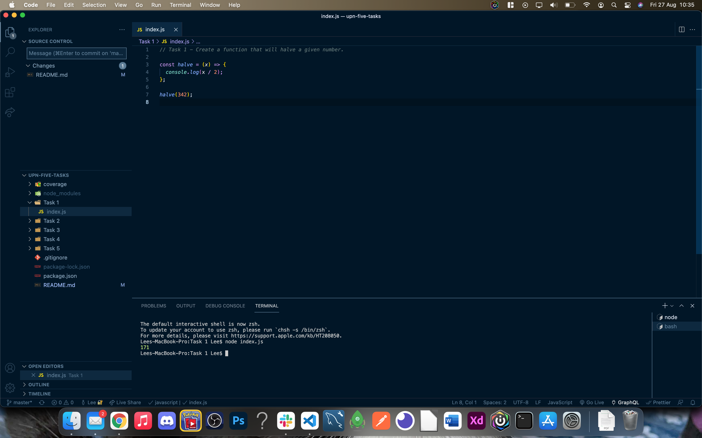

# UPN 5 Tasks


## Table of Contents

- [UPN 5 Tasks](#upn-5-tasks)
  - [Table of Contents](#table-of-contents)
  - [Description](#description)
  - [Installation](#installation)
  - [Usage](#usage)
  - [Licence](#licence)
  - [Tests](#tests)
  - [Screenshots](#screenshots)

## Description

This code was completed as a task for the United Pallet Network. I was given 5 javascript tasks to complete, each with varying levels of difficulty.

The tasks are as follows:

- Task 1:
  Create a function that will halve a given number.

- Task 2:
  Create a function that will multiply two numbers together and add 3.

- Task 3:
  Create a function to calculate how many times 1000 needs to be halved to be less than 10.

- Task 4: Create a function that accepts an array of numbers and returns an array that has had all values above a given number removed.

- Task 5: Create a function to determine the winner of this card game.
  Two players are dealt five cards from a standard deck. The winner is the player with the best Hand.

## Installation

```
git clone git@github.com:LeeFarnell/upn-five-tasks.git

cd upn-five-tasks

npm install
```

## Usage

- To use this, you should have node.js installed.
- Open your terminal in order to see the results of the tasks, as the majority of these will appear in the console log.
- On task 5, run 'npm run test:watch' in order to run the tests and watch the task play out.

## Licence

This content is licenced under the MIT Licence.
https://www.mit.edu/~amini/LICENSE.md

## Tests

Tests are completed via jest. Run 'npm run test' in the terminal to complete the testing.

## Screenshots




